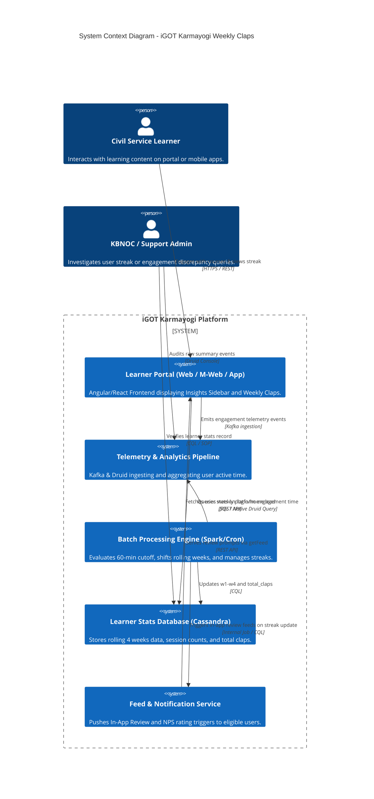
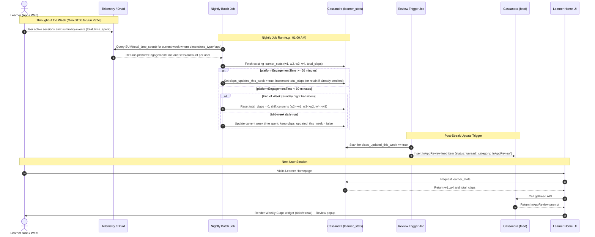

# Weekly Claps — Context & Architecture Diagrams

## 2.1 System Context Diagram (Level 0 / Level 1)

```mermaid
C4Context
    title System Context Diagram - iGOT Karmayogi Weekly Claps
    Person(learner, "Civil Service Learner", "Interacts with learning content on portal or mobile apps.")
    Person(admin, "KBNOC / Support Admin", "Investigates user streak or engagement discrepancy queries.")
    System_Boundary(igot_platform, "iGOT Karmayogi Platform") {
        System(portal_ui, "Learner Portal (Web / M-Web / App)", "Angular/React Frontend displaying Insights Sidebar and Weekly Claps.")
        System(telemetry_pipe, "Telemetry & Analytics Pipeline", "Kafka & Druid ingesting and aggregating user active time.")
        System(batch_engine, "Batch Processing Engine (Spark/Cron)", "Evaluates 60-min cutoff, shifts rolling weeks, and manages streaks.")
        System(stats_store, "Learner Stats Database (Cassandra)", "Stores rolling 4 weeks data, session counts, and total claps.")
        System(feed_service, "Feed & Notification Service", "Pushes In-App Review and NPS rating triggers to eligible users.")
    }
    Rel(learner, portal_ui, "Engages with courses & views streak", "HTTPS / REST")
    Rel(portal_ui, telemetry_pipe, "Emits engagement telemetry events", "Kafka ingestion")
    Rel(batch_engine, telemetry_pipe, "Queries weekly platform engagement time", "SQL / Native Druid Query")
    Rel(batch_engine, stats_store, "Updates w1-w4 and total_claps", "CQL")
    Rel(portal_ui, stats_store, "Fetches user stats on login/home load", "REST API")
    Rel(batch_engine, feed_service, "Triggers in-app review feeds on streak update", "Internal Job / CQL")
    Rel(feed_service, portal_ui, "Serves review prompts via getFeed", "REST API")
    Rel(admin, telemetry_pipe, "Audits raw summary events", "Druid Console")
    Rel(admin, stats_store, "Verifies learner stats record", "CQL / SOP")
```

## 2.2 End-to-End Processing & Lifecycle Flow

```mermaid
sequenceDiagram
    autonumber
    actor Learner as Learner (App / Web)
    participant Telemetry as Telemetry / Druid
    participant BatchJob as Nightly Batch Job
    participant DB as Cassandra (learner_stats)
    participant FeedJob as Review Trigger Job
    participant FeedDB as Cassandra (feed)
    participant UI as Learner Home UI
    Note over Learner,Telemetry: Throughout the Week (Mon 00:00 to Sun 23:59)
    Learner->>Telemetry: User active sessions emit summary-events (total_time_spent)
    Note over BatchJob,DB: Nightly Job Run (e.g., 01:00 AM)
    BatchJob->>Telemetry: Query SUM(total_time_spent) for current week where dimensions_type='app'
    Telemetry-->>BatchJob: Returns platformEngagementTime and sessionCount per user
    BatchJob->>DB: Fetch existing learner_stats (w1, w2, w3, w4, total_claps)
    alt platformEngagementTime >= 60 minutes
        BatchJob->>DB: Set claps_updated_this_week = true, increment total_claps (or retain if already credited)
    else platformEngagementTime < 60 minutes
        alt End of Week (Sunday night transition)
            BatchJob->>DB: Reset total_claps = 0, shift columns (w2->w1, w3->w2, w4->w3)
        else Mid-week daily run
            BatchJob->>DB: Update current week time spent#59; keep claps_updated_this_week = false
        end
    end
    Note over FeedJob,FeedDB: Post-Streak Update Trigger
    FeedJob->>DB: Scan for claps_updated_this_week == true
    FeedJob->>FeedDB: Insert InAppReview feed item (status: 'unread', category: 'InAppReview')
    Note over Learner,UI: Next User Session
    Learner->>UI: Visits Learner Homepage
    UI->>DB: Request learner_stats
    DB-->>UI: Return w1..w4 and total_claps
    UI->>FeedDB: Call getFeed API
    FeedDB-->>UI: Return InAppReview prompt
    UI->>Learner: Render Weekly Claps widget (ticks/streak) + Review popup
```
