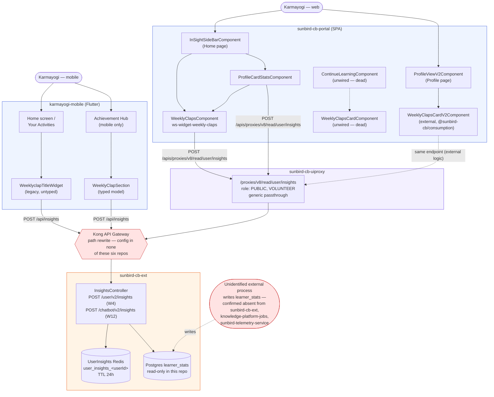

# Weekly Claps — HLD

Reverse-engineered across six repos: `sunbird-cb-portal` (`cbrelease-4.8.41`,
commit `31a57e9b`), `sunbird-cb-ext` (`cbrelease-4.8.41`, commit `55e79421`),
`sunbird-cb-uiproxy` (`cbrelease-4.8.41`, commit `175d24c4`),
`karmayogi-mobile`/`igot_karmayogi_mobile` (`master`, commit `e0deaf59`),
`knowledge-platform-jobs` (`cbrelease-4.8.41`, commit `dd314964`) and
`sunbird-telemetry-service` (`cbrelease-4.8.15`, commit `b682baec`) — the
last two confirmed to have no involvement (see [APIs](apis.md)).

## Topology

Weekly Claps is a read-only stats widget with no dedicated route on either
client. One backend endpoint pair (`sunbird-cb-ext`) is the only place
claps data is assembled, from a Postgres table this feature's own repo
cluster never writes to. Every client — three implementations on the web,
two on mobile — independently fetches the same shape and renders its own
copy of the same visual idea (running total + four-week strip).

The two red boxes are the feature's real gaps: the Kong path rewrite and
the write side of `learner_stats` are both invisible from every repo this
documentation set covers.

## Responsibilities

| Component | Responsibility |
|---|---|
| `InsightsController` / `InsightsServiceImpl` (`sunbird-cb-ext`) | The only place a claps response is assembled — Redis-then-Postgres read, JSON parsing of stored week fields, cache write-through (even for empty results) |
| `/proxies/v8/read/user/insights` (`sunbird-cb-uiproxy`) | Role gate (`PUBLIC`/`VOLUNTEER`) plus a fixed-target passthrough to Kong — no feature-specific logic |
| `WeeklyClapsComponent` (`ws-widget-weekly-claps`, `sunbird-cb-portal` library) | The one **live**, shared web widget — used by the Home page's insight sidebar and (as a fallback) by the profile-card-stats widget |
| `WeeklyClapsCardV2Component` (external, `@sunbird-cb/consumption`) | The web Profile page's own implementation — versioned and released independently of `sunbird-cb-portal`, opaque to this repo |
| `WeeklyClapsCardComponent` / `ContinueLearningComponent` (`sunbird-cb-portal`, app-local) | A third, fully-built implementation with no live caller — dead code as of this commit |
| `WeeklyclapTitleWidget` (`karmayogi-mobile`, legacy) | Untyped, reused across the mobile Home screen and Your Activities |
| `WeeklyClapSection` (`karmayogi-mobile`, Achievement Hub) | A separately-built, typed reimplementation, mobile-only, with its own request body that (unlike the legacy path) omits `rootOrgId` |
| `InAppReviewPopupOnWeeklyClap` (`karmayogi-mobile`) | Shows a store-rating prompt driven entirely by a server-issued feed item, not by any client-computed clap count |

**Not present in any of the six repos**: the process that computes and
writes `total_claps` / the weekly breakdown fields into `learner_stats`;
the internal logic of `@sunbird-cb/consumption`'s
`WeeklyClapsCardV2Component`; and the Kong gateway config that maps
`${KONG_API_BASE}/insights` and `/api/insights` onto
`InsightsController`'s actual `/user/v2/insights` route.

## Key design decisions

- **Read-only by construction, everywhere.** Every client and the backend
  controller itself only read claps data — there is no write path anywhere
  in this documentation set's repos. The feature composes an external,
  unidentified data producer the same way Bharat Kalp composes existing
  platform services, except here the producer isn't even identifiable from
  source.
- **Three implementations on web, two on mobile, no shared component
  across platforms.** Each platform (and, on web, each of three routes)
  independently fetches the same endpoint and renders its own card. This
  keeps each surface free to diverge in layout, but it has already
  produced real divergence: different request payloads (mobile Achievement
  Hub omits `rootOrgId`; every other call site includes it), different
  error-handling behavior (the app-local vs. library `HomePageService`
  disagree on what an unemitting vs. completing Observable means for a
  perpetually-loading spinner), and one implementation (web's
  `ContinueLearningComponent`) that was built and then never wired in.
- **Aggressive, write-through caching that doesn't distinguish "no data" from
  "cached empty."** The backend caches a user's claps response for 24
  hours regardless of whether a `learner_stats` row exists — a genuinely
  new user and a user whose data hasn't loaded yet look identical to every
  client for up to a day. See the [Operations Manual](operations-manual.md).
- **Client-side, not server-side, review-prompt logic.** The mobile app's
  "rate us" popup looks tied to weekly claps, but is entirely driven by a
  generic server-side feed item (`category: InAppReview`) — the phone never
  checks a clap threshold itself. If the intent is genuinely
  clap-count-gated prompting, that gate lives entirely on a backend not
  covered here.
- **A field-name alias baked into every web call site.** All five web call
  sites independently perform the same
  `insightsData['weekly-claps'] -> insightsData['weeklyClaps']`
  translation — copy-pasted rather than centralized — because the backend
  key is hyphenated JSON and Angular templates prefer camelCase. A future
  backend rename would require updating five places identically.

See the [LLD](lld.md) for file-level detail and sequence flows, and the
[Operations Manual](operations-manual.md) for how these decisions surface
in day-2 support.

---

> **Verification boundary:** facts above are read from the six repos named
> at the top of this document, at the commits listed. Not analysed from
> source: the Kong API Gateway's routing/rewrite configuration; whatever
> process writes `learner_stats`; and the `@sunbird-cb/consumption` and
> `@sunbird-cb/utils-v2` published packages consumed by `sunbird-cb-portal`
> — their behavior is inferred only from how the portal code calls them.
