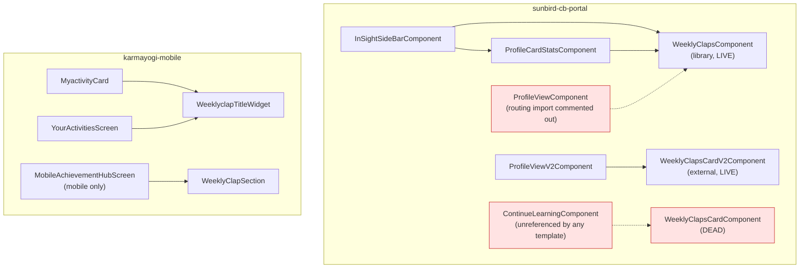

# Weekly Claps — LLD

Reverse-engineered across `sunbird-cb-portal` (`cbrelease-4.8.41`, commit
`31a57e9b`), `sunbird-cb-ext` (`cbrelease-4.8.41`, commit `55e79421`),
`sunbird-cb-uiproxy` (`cbrelease-4.8.41`, commit `175d24c4`), and
`karmayogi-mobile`/`igot_karmayogi_mobile` (`master`, commit `e0deaf59`).
File paths are relative to each named repo's root. Companion to the
[HLD](hld.md).

## File inventory

### Backend (`sunbird-cb-ext`)

| File | Role |
|---|---|
| `src/main/java/org/sunbird/insights/controller/InsightsController.java` | REST surface — `POST /user/v2/insights` (W4), `POST /chatbot/v2/insights` (W12), plus unrelated insights routes on the same class |
| `src/main/java/org/sunbird/insights/controller/service/InsightsServiceImpl.java` | `insights()`, `populateIfClapsExist()`, `getClapsFromUserInsightsRedis()`, `parseWeekField()` — the entire claps assembly logic |
| `src/main/java/org/sunbird/insights/entity/LearnerStatsEntity.java` | JPA mapping for `learner_stats` (`userid` PK, `total_claps`, `w0`–`w4`, `wn1`–`wn7`, `claps_updated_this_week`, `last_claps_updated_on`) |
| `src/main/java/org/sunbird/insights/repository/LearnerStatsRepository.java` | Plain `JpaRepository`, no custom queries — `findById` is the only call site repo-wide |
| `src/main/java/org/sunbird/common/util/Constants.java` | `WEEKLY_CLAPS="weekly-claps"` (:824), `TOTAL_CLAPS="total_claps"` (:855), `LEARNER_STATS="learner_stats"` (:870) |
| `src/main/resources/application.properties:669-673,714-716` | Redis host/port/TTL/index for the UserInsights instance; week-range field lists and cache-key prefixes per mode |

### Gateway proxy (`sunbird-cb-uiproxy`)

| File | Role |
|---|---|
| `src/proxies_v8/proxies_v8.ts:309-311` | Mounts `/read/user/insights` → generic passthrough to `${KONG_API_BASE}/insights` |
| `src/utils/whitelistApis.ts:2645-2652` | Whitelist entry: `checksNeeded: [ROLE]`, `ROLE_CHECK: [PUBLIC, VOLUNTEER]` |
| `src/utils/env.ts:60` | `KONG_API_BASE` resolution (env override, default `https://portal.karmayogi.nic.in/api`) |
| `src/utils/proxyCreator.ts:376-387` | `proxyCreatorSunbirdSearch` — the generic, route-agnostic passthrough factory used here (and by ~dozens of other routes) |

### Web (`sunbird-cb-portal`)

| File | Role |
|---|---|
| `library/ws-widget/collection/src/lib/_common/weekly-claps/weekly-claps.component.ts/.html` (`ws-widget-weekly-claps`) | **Live** shared widget — Home page (via insight sidebar, directly and via profile-card-stats fallback) |
| `library/ws-widget/collection/src/lib/_common/profile-card-stats/profile-card-stats.component.ts/.html` | Wraps the weekly-claps widget as a fallback when there's no leaderboard rank; owns the anchor-scroll redirect |
| `library/ws-widget/collection/src/lib/_services/home-page.service.ts:20-26` | Library copy of `getInsightsData` — returns `EMPTY` when the endpoint is disabled |
| `src/app/services/home-page.service.ts:21-28` | App-local copy of the same method — returns a bare `Observable()` (never emits/completes) when disabled — **diverges from the library copy** |
| `src/app/component/in-sight-side-bar/in-sight-side-bar.component.ts/.html` | Home-page host: gates the whole insights fetch on `homePageData.weeklyClaps.enabled \|\| homePageData.profileCard.enabled` |
| `src/app/component/custom-home/custom-home.component.ts/.html` | Custom-Home host: fetches insights unconditionally, no `weeklyClaps.enabled` gate |
| `src/app/home/home/continue-learning/continue-learning.component.ts/.html` | **Dead** — computes its own `week1..week4` boundaries client-side; not referenced by any live template |
| `src/app/home/home/continue-learning/weekly-claps-card/weekly-claps-card.component.ts/.html/.scss` | **Dead** — from-scratch rebuild with ARIA labels and an inline popup dialog; only reachable through the dead `ContinueLearningComponent` |
| `project/ws/app/src/lib/routes/profile-v2/routes/profile-view-v2/profile-view-v2.component.ts/.html` | **Live** Profile-page host — renders external `sb-uic-weekly-claps-card-v2` in the "My Statistics" tab |
| `project/ws/app/src/lib/routes/profile-v2/routes/profile-view/profile-view.component.ts/.html` | **Dead** — its routing import is commented out (`profile-v2.rounting.module.ts:6`); embeds the same widget as UC-1 but is unreachable |
| `project/ws/app/src/lib/routes/profile-v2/services/profile-v2-revamp.service.ts:432-440` | Third parallel `getInsightsData` implementation, resolves via `API_END_POINTS.INSIGHTS` |

### Mobile (`karmayogi-mobile`)

| File | Role |
|---|---|
| `lib/features/profile/data/services/profile_service.dart:319-338` (`getUserInsights`) | Legacy fetch — includes `rootOrgId` in the request |
| `lib/features/profile/data/repositories/profile_repository.dart:367-378` (`getInsights`) | Untyped result passthrough; callers must runtime-check for error strings |
| `lib/ui/widgets/_activities/weeklyclap_title_widget.dart` (`WeeklyclapTitleWidget`) | Legacy, untyped widget — used by both Home screen and Your Activities |
| `lib/ui/widgets/_home/myactivity_card.dart` / `home_myactivity_content_strip.dart` | Home-screen host — its own `weeklyClaps` module-enable check, defaulting to enabled |
| `lib/features/profile/presentation/screens/mobile/your_activities/your_activities.dart:263-316,331-362` | Your Activities host — renders `WeeklyclapTitleWidget` (row layout) plus its own week-cell rendering |
| `lib/features/achievement_hub/data/repositories/achievement_hub_repository.dart:13-33` (`getWeeklyClap`) | Achievement Hub fetch — request body from static config, **omits `rootOrgId`** |
| `lib/features/achievement_hub/data/services/achievement_hub_service.dart:9-22` (`fetchInsights`) | HTTP call — no `ttl` passed, unlike sibling calls in the same file |
| `lib/features/achievement_hub/data/models/weekly_clap_model.dart` | Typed `WeeklyClap`/`WeekEntry`, `isEarned = timespent >= 60` |
| `lib/features/achievement_hub/presentation/widgets/weekly_clap_section.dart` | Achievement Hub card — mobile-only; `snapshot.data!` force-unwrap on a nullable future (latent crash risk) |
| `lib/core/configurations/achievement_hub_config.dart:93-123,253-283` | Static config: `apiUrl`, `requestBody`, per-org `enabled` flags |
| `lib/core/configurations/profile_config.dart:376,434,844,902` | `myActivitiesTab` (parent, `enabled: false` in sampled configs) vs. nested `weeklyClaps` component (`enabled: true`) |
| `lib/ui/skeleton/widgets/weeklyclap_skeleton.dart` | Shared skeleton for the legacy widget (both host screens) |
| `lib/features/achievement_hub/presentation/widgets/skeleton/achievement_hub_skeleton.dart:127-137` | Separate, non-animated skeleton for the Achievement Hub's own card |
| `lib/respositories/_respositories/nps_repository.dart:12-33` / `in_app_review_repository.dart:102-115` | Server feed poll (`category: InAppReview`) driving the store-review popup — not clap-count logic |
| `lib/ui/widgets/_rating/in_app_review_on_weekly_clap.dart` | The popup itself — "Rate Now" deletes the feed item and opens the store; "Maybe Later" deletes it without opening the store |
| `lib/core/telemetry/constants/telemetry_constants.dart:79,115,405,413,415` | `weeklyClaps`, `weeklyClapsRateNow`, `weeklyClapsInfo`, `mayBeLater`, `rateNow` event identifiers |
| `lib/core/constants/storage_constants.dart:34` (`Storage.totalClaps`) | Declared, backed up/restored across logout-login, but **never written** by any clap code path — vestigial |

## Component tree


*Red nodes are confirmed dead/unreachable in this repo at this commit —
static-analysis confirmed (no template/module reference), but a
CMS-driven widget-resolver mechanism could theoretically still surface
them at runtime; see the Verification boundary.*

## Sequence — web Home page (live path)

```mermaid
sequenceDiagram
    participant U as Karmayogi
    participant ISB as InSightSideBarComponent
    participant Svc as HomePageService (app)
    participant Px as sunbird-cb-uiproxy
    participant K as Kong Gateway
    participant Ext as InsightsController
    participant R as UserInsights Redis
    participant PG as Postgres learner_stats

    U->>ISB: Load Home page
    ISB->>ISB: check homePageData.weeklyClaps.enabled OR profileCard.enabled
    alt gate passes
        ISB->>Svc: getInsightsData(payload)
        Svc->>Px: POST /apis/proxies/v8/read/user/insights
        Px->>Px: role check (PUBLIC/VOLUNTEER)
        Px->>K: forward (ignorePath) to KONG_API_BASE/insights
        K->>Ext: rewritten to POST /user/v2/insights (not confirmed in any repo)
        Ext->>R: GET user_insights_<userId>
        alt cache hit
            R-->>Ext: cached claps (dates refreshed)
        else cache miss
            Ext->>PG: findById(userId)
            PG-->>Ext: row, or nothing
            Ext->>R: SET user_insights_<userId> (TTL 24h) — even if empty
        end
        Ext-->>K: { weekly-claps, nudges }
        K-->>Px-->>Svc-->>ISB: response
        ISB->>ISB: alias weekly-claps -> weeklyClaps
        ISB-->>U: render WeeklyClapsComponent
    else gate fails
        ISB-->>U: no widget, no API call
    end

    Note over Svc,Ext: If the endpoint is disabled server-side, the app's<br/>HomePageService returns a bare Observable() that never<br/>emits or completes — the loading flag never clears
```

## Access / gating summary

| Surface | Gate | Source |
|---|---|---|
| Web Home page | `homePageData.weeklyClaps.enabled \|\| homePageData.profileCard.enabled` | `in-sight-side-bar.component.ts:209-211` |
| Web Custom Home | none (unconditional fetch) | `custom-home.component.ts:130` |
| Web Profile page | Achievement section, "My Statistics" tab is the default view | `profile-view-v2.component.html:511` |
| Mobile Home screen | `activityConfig.modules.weeklyClaps.enabled`, default `true` | `myactivity_card.dart:38-45` |
| Mobile Your Activities | `weeklyClaps` component entry `enabled: true`, nested under a `myActivitiesTab` sampled as `enabled: false` | `profile_config.dart:376,434,844,902` |
| Mobile Achievement Hub | static per-org config, `true`/`false` per org | `achievement_hub_config.dart:121,281` |

None of these are the same mechanism as Bharat Kalp's user-profile
membership flag — Weekly Claps has no per-user access control at all, only
per-surface visibility config.

## Recommendations carried forward (design debt, not bugs to silently fix)

1. Reconcile the app-local vs. library `HomePageService.getInsightsData` —
   one returns a never-emitting `Observable()`, the other `EMPTY`, for the
   same "endpoint disabled" case (see Operations Manual).
2. Remove or wire in `ContinueLearningComponent` / `WeeklyClapsCardComponent`
   / `ProfileViewComponent` — confirmed unreachable via static analysis;
   dead code carries real ARIA and telemetry investment that's currently
   wasted.
3. Fix the mobile Achievement Hub's stale comment/behavior mismatch —
   either inject `rootOrgId` into the request body to match the legacy
   path, or remove the comment claiming it's injected.
4. Guard `weekly_clap_section.dart:100`'s `snapshot.data!` against a
   resolved `null` future — `getWeeklyClap` can legitimately return `null`.
5. Consider whether an empty `learner_stats` lookup should be cached for
   the same 24h TTL as a populated one — a brand-new user currently looks
   identical to an outage for a full day.

---

> **Verification boundary:** facts above are read from the four repos named
> at the top of this document, at the commits listed. Not analysed from
> source: the Kong gateway's path-rewrite config; the write side of
> `learner_stats`; the internal behavior of `@sunbird-cb/consumption`'s
> `WeeklyClapsCardV2Component` and `@sunbird-cb/utils-v2`'s
> `DomainConfService`/`EventService` (external packages, not vendored);
> and whether a CMS-driven widget-resolver mechanism (seen imported in
> `custom-home.module.ts:7,42` as `@sunbird-cb/resolver`) could still
> surface the components marked dead above at runtime through
> configuration this repo doesn't contain.
