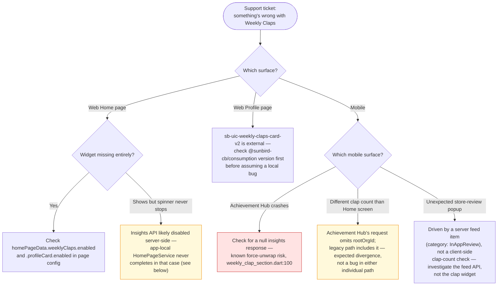

# Operations Manual — Weekly Claps

How to operate, support and troubleshoot Weekly Claps as it exists today —
a read-only stats widget implemented five times across two clients, backed
by one Postgres table none of these repos writes to. Verified against
`sunbird-cb-portal` (`cbrelease-4.8.41`, commit `31a57e9b`),
`sunbird-cb-ext` (`cbrelease-4.8.41`, commit `55e79421`),
`sunbird-cb-uiproxy` (`cbrelease-4.8.41`, commit `175d24c4`), and
`karmayogi-mobile`/`igot_karmayogi_mobile` (`master`, commit `e0deaf59`);
companion to the [HLD](hld.md) and [LLD](lld.md).

## System overview

A Karmayogi's "claps" — a per-week engagement flag earned once they spend
60+ minutes on the platform in that week — are read, never written, by
every repo in this documentation set. The number and weekly breakdown come
from a `learner_stats` Postgres row (`sunbird-cb-ext`), fronted by a
24-hour Redis cache, reached via `POST /user/v2/insights`. Both web and
mobile clients reach that same endpoint through different literal paths
whose translation happens in Kong gateway config outside every repo here.

## Important fields

| Field | Meaning | Why it matters |
|---|---|---|
| `learner_stats.total_claps` | Lifetime (or rolling) clap count | The headline number every widget shows; this repo cluster only reads it |
| `learner_stats.w0`–`w4` / `wn1`–`wn7` | Per-week breakdown, stored as JSON-encoded strings | `w1`–`w4` (the "W4" mode) is what every traced client actually uses; `w0`/`wn1`–`wn7` only serve the `/chatbot/v2/insights` (W12) mode, which no traced client calls |
| `learner_stats.claps_updated_this_week` / `last_claps_updated_on` | Bookkeeping columns on the same row | Not read by `InsightsServiceImpl`'s claps path at all — present in the entity but unused by the code that serves clients |
| Redis key `user_insights_<userId>` | 24h cache of the full claps response | A cache hit skips Postgres entirely, including for a row that doesn't exist — see the troubleshooting guide |
| `homePageData.weeklyClaps.enabled` (web) / `activityConfig.modules.weeklyClaps.enabled` (mobile) | Per-surface visibility toggles | The only "on/off switch" for this feature — there's no per-user access gate like Bharat Kalp's membership flag |

## Where the feature surfaces

| Surface | Live? | Gate | Endpoint |
|---|---|---|---|
| Web Home page (insight sidebar) | ✅ | `weeklyClaps.enabled` or `profileCard.enabled` | `POST /apis/proxies/v8/read/user/insights` |
| Web Custom Home page | ✅ | none (unconditional) | same |
| Web Profile page ("My Statistics") | ✅ | tab default | same |
| Web `ContinueLearningComponent` / dead `ProfileViewComponent` | ❌ | n/a | built, never routed |
| Mobile Home screen "My Activity" | ✅ | module-enable, default on | `POST /api/insights` |
| Mobile Your Activities | ✅ | component-level enable | same |
| Mobile Achievement Hub (mobile only, not tablet) | ✅ | per-org static config | `POST /api/insights` (different request body — omits `rootOrgId`) |

If a user reports the widget "missing" on web, check which of the three
live call sites they're looking at — they're independently gated and can
legitimately disagree.

## Dependencies to watch

| Service | Endpoint | Impact if down/erroring |
|---|---|---|
| `sunbird-cb-ext` `InsightsController` | `POST /user/v2/insights` | Every claps widget on every surface fails or shows stale/empty data |
| UserInsights Redis instance | n/a (internal to `sunbird-cb-ext`) | Falls back to Postgres on read failure; a write failure is logged and swallowed — requests still succeed, just uncached |
| `sunbird-cb-uiproxy` role check | `/proxies/v8/read/user/insights` | A user without `PUBLIC`/`VOLUNTEER` role gets a 403 before the request ever reaches the backend |
| Kong API Gateway | path rewrite from `/insights`-shaped paths to `/user/v2/insights` | Entirely opaque to this documentation set — a gateway config change could silently break every client with no commit in any of these six repos |
| Whatever writes `learner_stats` | unidentified | If it stops running, every user's claps eventually go stale relative to real activity — indistinguishable from "no claps earned" to any client here |

## Troubleshooting guide

### "Web Home page's claps widget spins forever"

Root cause candidate: the "insights" API has been disabled via remote
config (`DomainConfService.getApiUrl` resolves to a falsy URL). The
**app-local** `HomePageService.getInsightsData` (`src/app/services/`)
returns a bare `new Observable()` in that case — it never emits `next` or
`complete`, so any `isLoading` flag set before the call never clears. The
**library** copy of the same method (`library/.../home-page.service.ts`)
returns `EMPTY` instead, which does complete. Confirm which service
instance the affected component actually uses before concluding this is
the cause — not every widget shares the app-local instance.

### "A new user sees zero claps but should have some"

Check whether this is a genuine zero or a 24-hour-stale cache: the backend
caches an **empty** claps object for the full TTL the first time it looks
up a user with no `learner_stats` row yet — indistinguishable from "really
has zero claps" until the cache expires or is manually cleared. There is
no separate "not yet computed" state.

### "Web and mobile (or two mobile screens) show different clap counts for the same user"

Expected, not a bug, if one of the differing surfaces is the mobile
Achievement Hub: its request body omits `rootOrgId` from
`filters.organisations` while every other call site (legacy mobile, all
web call sites) includes it. If backend filtering behaves differently for
`["across"]` vs. `["across", rootOrgId]`, the two will diverge by design of
this omission (not confirmed to be intentional — see the LLD
recommendations).

### "Mobile Achievement Hub crashes on the Weekly Claps card"

Check for a resolved-`null` insights response.
`AchievementHubRepository.getWeeklyClap` can return `null` on any error;
`WeeklyClapSection`'s `FutureBuilder` treats a resolved `null` as
`hasData: true` and force-unwraps it (`weekly_clap_section.dart:97,100`) —
a real crash risk with no test coverage exercising this path.

### "User got a store-rating popup right after seeing their claps"

This is expected and not clap-threshold logic on the phone: the popup is
triggered by a generic server-side "user feed" item with
`category: InAppReview`, polled independently on Home-screen load. If a
user reports getting the popup repeatedly, or never getting it despite
clearly qualifying, investigate the feed API / whatever server-side
process issues `InAppReview` feed items — not the clap widget itself.

## Monitoring recommendations

No claps-specific telemetry exists on the backend read path in
`sunbird-cb-ext` (no metrics/logging beyond generic info/warn logs on cache
hit/miss). On the clients: web fires interact telemetry on "know more"/info
taps only (not on load or on API failure); mobile fires telemetry on the
in-app-review popup's impression and button taps, plus an info-icon tap
that is inconsistently wired (the row-layout branch of
`WeeklyclapTitleWidget` doesn't fire it; the column-layout branch does).
None of this constitutes failure monitoring. Recommend:

- A backend metric/log on `populateIfClapsExist` distinguishing
  cache-hit / Postgres-hit / Postgres-miss (empty result cached), so a
  spike in "empty" responses can be told apart from a real outage.
- A client-side telemetry event on the never-completing `Observable()`
  code path in the app-local `HomePageService`, so a config-disabled
  endpoint doesn't silently manifest only as user-reported "stuck
  spinner" tickets.

## Release and deploy notes

- The web widget's visibility flags (`weeklyClaps.enabled`,
  `profileCard.enabled`) are resolved from CMS/form-service page config,
  not from any environment file in `sunbird-cb-portal` — toggling this
  feature per environment happens through that external config, not a
  code deploy.
- The mobile Achievement Hub config (`achievement_hub_config.dart`) is a
  statically-compiled Dart map, selected per org variant at build/flavor
  time — changing which orgs see the Achievement Hub claps card requires a
  mobile app release, unlike the web's config-service-driven toggle.
- `ContinueLearningComponent` / `WeeklyClapsCardComponent` ship in the web
  bundle (built, translated, ARIA-labeled) despite being unreachable —
  removing them would shrink the bundle with no behavior change, but
  confirm first that no CMS-driven widget-resolver path can still surface
  them (see the LLD Verification boundary).

## Known operational constraints

See the [LLD](lld.md) recommendations for the engineering-facing version:
1. App-local vs. library `HomePageService` disagree on end-of-stream
   behavior for a disabled endpoint (spinner-forever risk).
2. A 24-hour cache doesn't distinguish "no data yet" from "confirmed
   zero."
3. Mobile Achievement Hub's request body omits `rootOrgId`, unlike every
   other call site — a likely unintentional divergence.
4. A null-assertion crash risk in the mobile Achievement Hub card with no
   test coverage.
5. Three web implementations and two mobile implementations of the same
   idea, one of the web ones fully dead.

## Escalation

Owners below are functional, derived from the dependency list — no named
team or on-call rotation for this feature specifically was found in any
traced repo.

| Issue type | Owner | Escalate when |
|---|---|---|
| Wrong/missing claps data for a user | Backend / data-platform team | `learner_stats` row looks wrong or missing, or the write-side job (unidentified in these repos) needs investigating |
| Cache staleness | Backend team (`sunbird-cb-ext`) | A user's data doesn't reflect a recent change well past the 24h TTL |
| Gateway routing failures | Platform / infra team (Kong config) | Every client's claps call fails identically, but `sunbird-cb-ext` itself responds fine when called directly |
| Web widget bugs (any of the 3 implementations) | Web portal team | Confirm which of the three implementations first — see Where the feature surfaces |
| Mobile widget bugs (either implementation) | Mobile team | Confirm legacy vs. Achievement Hub path first — request bodies differ |
| Unexpected/missing in-app-review popups | Backend feed-service owner | The popup logic itself is confirmed correct in-repo; the issue is almost certainly the server-issued feed item |

Before escalating, capture: which surface/implementation (see the table
above), the user's id, whether the request included `rootOrgId`, and
whether the response was a cache hit or miss if backend logs are
available — this feature's failures are otherwise nearly silent.

---

> **Verification boundary:** operational facts above (gating, caching,
> divergent behaviors) are read from the four repos named at the top of
> this document. Not verified: no dashboards, alerts, or on-call rotation
> were found for this feature specifically; the monitoring
> recommendations above are proposed, not existing, instrumentation. The
> Kong gateway's routing behavior and whatever writes `learner_stats` are
> both outside every repo checked — attach those systems to close this
> gap.
