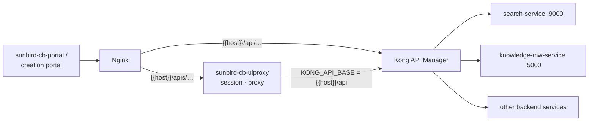

# API Gateway & Routing

**Verified from source** — `sunbird-cb-uiproxy` (Express proxy) and
`sunbird-devops › ansible/roles/kong-api/defaults/main.yml` (Kong mapping).

Every browser call from the portals leaves on one of two prefixes, split by
Nginx:

| Prefix | Handled by | Role |
|---|---|---|
| `{{host}}/apis/…` | **sunbird-cb-uiproxy** | Browser-facing proxy: Keycloak session → tokens, request shaping, then forwards to Kong (`KONG_API_BASE`) |
| `{{host}}/api/…` | **Kong** (deployed by `sunbird-devops › kong-api` role) | API manager: maps public URIs to internal service URLs |

The Kong route map is the single reference for "which service serves this
API": `ansible/roles/kong-api/defaults/main.yml` — each entry is
`name / uris / upstream_url`. Upstream hosts are internal service
DNS names (e.g. `http://search-service:9000`,
`http://knowledge-mw-service:5000`).

## Documentation convention

When documenting any API, trace and state the full path:

> portal → `/apis/proxies/v8/…` (uiproxy) → Kong `…uris…` → `upstream_url`
> (service, from the repo)

If the Kong entry or the serving repo cannot be found, **raise the question
in the doc and to the doc owner** — do not guess the backend.

## Worked example — composite search

| Portal path (`/apis/proxies/v8/…`) | uiproxy forwards to (Kong URI) | Kong upstream | Serving code |
|---|---|---|---|
| `sunbirdigot/search` | `composite/v1/search` | `knowledge-mw-service:5000/v1/search` | legacy middleware relay (see boundary note) |
| `sunbirdigot/v4/search` | `composite/v4/search` | `search-service:9000/v4/search` | `knowledge-platform › search-api` |
| `composite/v5/search` | `composite/v5/search` | `search-service:9000/v5/search` | `ExtendedSearchController.searchV5` |
| `composite/v4/bp/search` | `composite/v4/bp/search` | `search-service:9000/v4/bp/search` | `ExtendedSearchController.blendedProgramSearch` |

> **Verification boundary:** knowledge-mw-service's v1 relay target is
> configured inside its `sb_content_provider` npm module (env-driven), which
> is not readable in the attached checkout — the v1 downstream is inferred to
> reach the same search stack. Confirm from deployment env if it matters.
