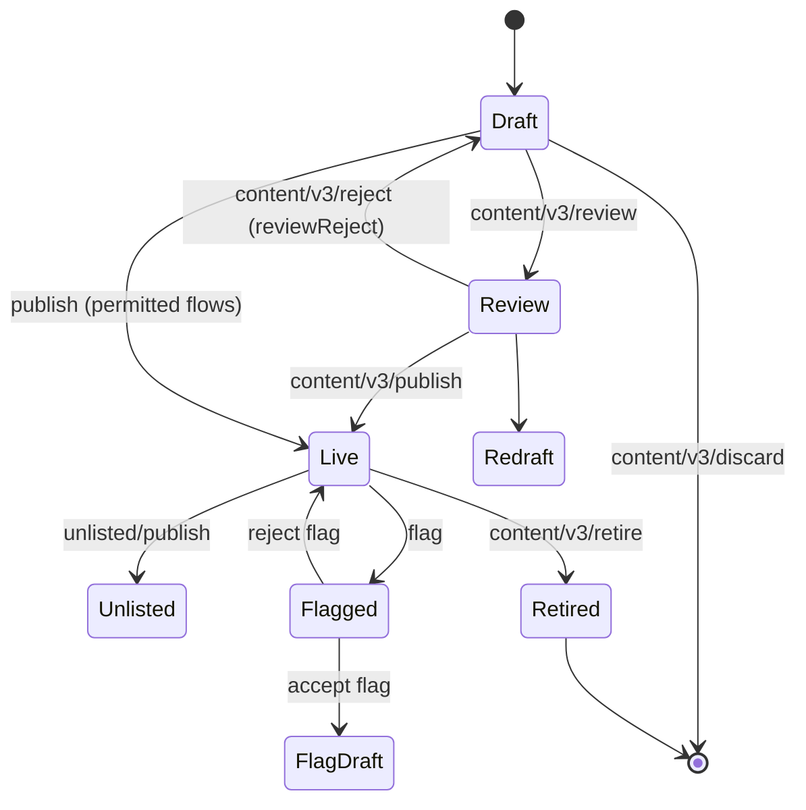

# Content Lifecycle (knowledge-platform)

**Verified from source** — `knowledge-platform › content-api` (content-service
Play routes, content-actors, content schema). This page covers the lifecycle
shared by every Learning Hub content type: Course, Curated Program, Blended
Program, assessments-as-content, and their assets.

## Status model

The content schema (`schemas/content/1.0/schema.json`) defines the full status
enum, default `Draft`:

Other schema states: `Mock`, `Processing` (transient — review is refused while
`Processing`), `FlagReview`, `Failed` (publish pipeline failure).

## Core routes (content-service `conf/routes`)

| Method | Route | Purpose |
|---|---|---|
| POST | `/content/v3/create` | Create (also `collection/v4`, `asset/v4` variants) |
| PATCH | `/content/v3/update/:id` | Metadata update |
| GET | `/content/v3/read/:id` | Read (`mode=edit` for draft view) |
| PATCH | `/content/v3/hierarchy/update` | Save collection structure (add/remove also exist) |
| GET | `/content/v3/hierarchy/:id` | Read hierarchy |
| POST | `/content/v3/review/:id` | Draft → Review (refused while `Processing`) |
| POST | `/content/v3/reject/:id` | Review → back to author (v4 `reviewReject`) |
| POST | `/content/v3/publish/:id` | Review → Live (also `unlisted/publish`) |
| DELETE | `/content/v3/discard/:id` | Drop a draft |
| DELETE | `/content/v3/retire/:id` | Live → Retired |
| POST | `/content/v3/upload/:id` · `upload/url/:id` | Artefact upload (direct / pre-signed) |
| POST | `/content/v3/copy/:id` · `import` · `bundle` · `flag/*` | Copy, import, bundle, flagging |

## Publish is asynchronous

Publishing does not transform content inline: the service emits an
**instruction event** to Kafka (`kafka.topics.instruction`, e.g.
`*.learning.job.request`) consumed by the publish pipeline jobs; graph
lifecycle operations (e.g. retire) emit to `kafka.topics.graph.event`
(`*.learning.graph.events`). The `Failed` status exists for pipeline failures,
and `Processing` guards concurrent transitions.

## Storage

The knowledge graph (ontology-engine: Neo4j-backed graph engine) holds node
metadata and relations; hierarchies are managed by `hierarchy-manager`;
binaries live in cloud storage via the upload routes.

## How the portals reach these APIs

The Creation Portal calls them through gateway aliases:
`action/content/v3/…` and `authApi/action/…` map onto the routes above (e.g.
`action/content/v3/review/:id` → `/content/v3/review/:id`).

> **Verification boundary:** the publish pipeline jobs themselves (Flink/Samza
> jobs consuming the instruction topic) are in a separate repo and not attached.
